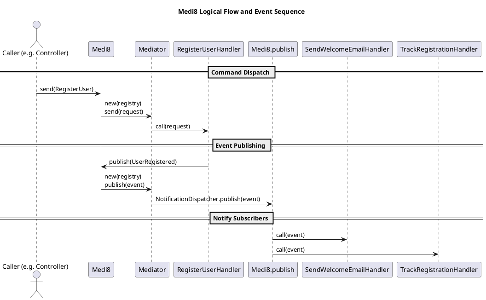

# Medi8-rb

[](https://badge.fury.io/rb/medi8-rb)
[](LICENSE)

Medi8 is a lightweight, idiomatic mediator pattern implementation for Ruby and Rails, inspired by MediatR (from .NET)

Medi8 is not a 1:1 Ruby analog of MediatR, but it faithfully implements its core principles in an idiomatic Ruby way.

Medi8 is compatible with pure Ruby, Sinatra, and Rails.

---

## Features

- Simple `send` method for commands and queries
- `publish` notifications to many subscribers
- Middleware pipeline
- Async notifications with ActiveJob
- Rails integration via `Railtie`
- Fully modular, no inheritance required

---

## Design



---

## Installation

Add this line to your Gemfile:

```ruby
gem "medi8-rb"
```

Then bundle:

```bash
$ bundle install
```

Or install it directly:

```bash
$ gem install medi8-rb
```

---

## Concept

Use `Medi8.send(request)` for command/query behavior, and `Medi8.publish(event)` for notifications. Handlers are registered with a simple DSL.

---

## Configuration

Set up in an initializer:

```ruby
# config/initializers/medi8.rb
Medi8.configure do |config|
  config.use AwesomeMiddleware
end
```

Example middleware:

```ruby
class AwesomeMiddleware
  def call(request)
    Rails.logger.info("Processing #{request.class.name}")
    yield
  end
end
```

---

## Usage

Medi8 uses a simple request/handler model. You define a request class, register a handler using handles, and then invoke `Medi8.send(request)`.

### Create a Request

```ruby
# app/requests/create_user.rb
class CreateUser
  attr_reader :name

  def initialize(name:)
    @name = name
  end
end
```

### Create a Handler

```ruby
# app/handlers/create_user_handler.rb
class CreateUserHandler
  include Medi8::Handler

  handles CreateUser

  def call(request)
    User.create!(name: request.name)
  end
end
```

### Send

```ruby
Medi8.send(CreateUser.new(name: "Alice"))
```

---

## Notifications

### Define an Event

```ruby
class UserRegistered
  attr_reader :user_id

  def initialize(user_id:)
    @user_id = user_id
  end
end
```

### Define a Subscriber

```ruby
class SendWelcomeEmail
  include Medi8::NotificationHandler

  subscribes_to UserRegistered, async: true

  def call(event)
    UserMailer.welcome_email(User.find(event.user_id)).deliver_later
  end
end
```

### Publish

```ruby
Medi8.publish(UserRegistered.new(user_id: 1))
```

---

## Advanced Usage

Medi8 is compatible with [Active CQRS](https://github.com/kiebor81/active_cqrs).

For project layout consistency, use `events` and `handlers/events` for your Medi8 classes. This will align nicely with the expected folder structures of Active CQRS. If following this advice, remember to auto-load these directories.

```ruby
    config.autoload_paths += %W[
      #{config.root}/app/events
      #{config.root}/app/handlers/events
    ]

    config.eager_load_paths += %W[
      #{config.root}/app/events
      #{config.root}/app/handlers/events
    ]
```

Alternatively, namespace appropriately if you prefer nested classes.

### Mediator Pattern with CQRS

Example Active CQRS command:

```ruby
# app/commands/create_user_command.rb
class CreateUserCommand
  attr_reader :name, :email

  def initialize(name:, email:)
    @name = name
    @email = email
  end
end
```

Active CQRS handler with Medi8:

```ruby
# app/handlers/commands/create_user_handler.rb
class CreateUserHandler
  def call(command)
    user = User.create!(name: command.name, email: command.email)

    Medi8.publish(UserRegistered.new(user_id: user.id, email: user.email))

    user
  end
end
```

Medi8 notification published from the handler:

```ruby
# app/events/user_registered.rb
class UserRegistered
  attr_reader :user_id, :email

  def initialize(user_id:, email:)
    @user_id = user_id
    @email = email
  end
end
```

Medi8 notification handler(s):

```ruby
# app/handlers/events/send_welcome_email_handler.rb
class SendWelcomeEmailHandler
  include Medi8::NotificationHandler
  subscribes_to UserRegistered

  def call(event)
    UserMailer.welcome_email(event.email).deliver_later
  end
end
```

```ruby
# app/handlers/events/track_user_registration_handler.rb
class TrackUserRegistrationHandler
  include Medi8::NotificationHandler
  subscribes_to UserRegistered

  def call(event)
    Rails.logger.info("=> User registered: #{event.user_id} (#{event.email})")
  end
end
```

Example controller:

```ruby
class UsersController < ApplicationController
  def create
    command = CreateUserCommand.new(
      name: params[:name],
      email: params[:email]
    )

    user = CQRS_COMMAND_BUS.call(command)
    render json: user, status: :created
  rescue ActiveRecord::RecordInvalid => e
    render json: { errors: e.record.errors.full_messages }, status: :unprocessable_entity
  end
end
```

---

## Testing

```bash
$ bundle exec rspec
```

### Mock E2E

Provided is an end-to-end mock flow under `mock_e2e`. Test this from the terminal.

```bash
ruby mock_e2e.rb
```

---

## License

MIT License © kiebor81

---

## Contributing

Bug reports and pull requests welcome.

1. Fork it
2. Create your feature branch (`git checkout -b my-feature`)
3. Commit your changes (`git commit -am 'Add feature'`)
4. Push to the branch (`git push origin my-feature`)
5. Create a new Pull Request